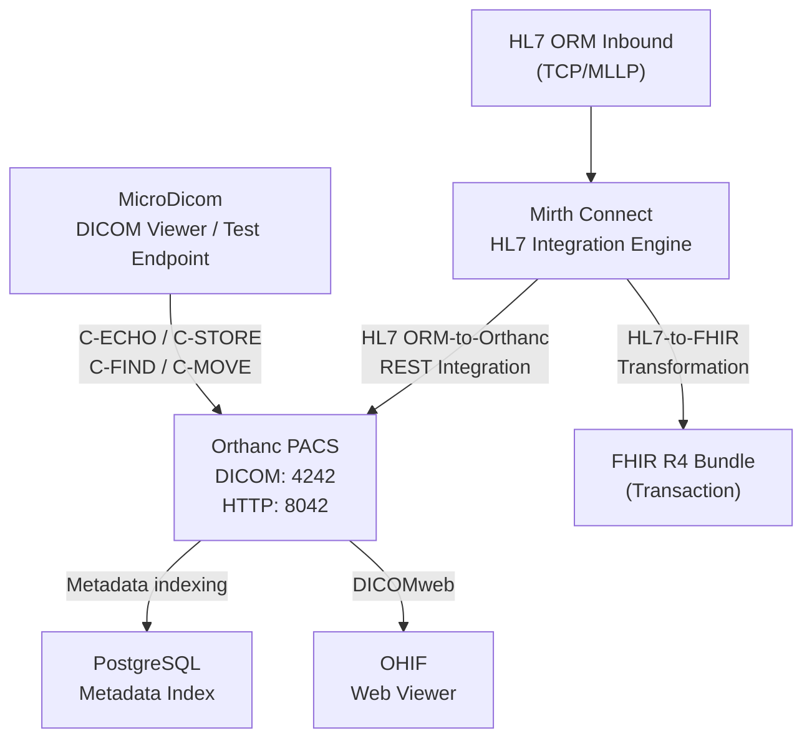

============================================================
ORTHANC PACS & HEALTHCARE IT INTEGRATION LAB
COMPLETE DOCUMENTATION PACK
============================================================

This single text file contains the complete Markdown content for the
documentation files used by the repository.

Create the following files by copying each corresponding section into
the matching path:

docs/architecture.md
docs/deployment.md
docs/dicom-testing.md
docs/mirth-hl7-fhir.md
docs/troubleshooting.md


============================================================
FILE: docs/architecture.md
============================================================

# System Architecture

## Overview

The Orthanc PACS & Healthcare IT Integration Lab is a containerized
healthcare IT environment designed to demonstrate how imaging systems,
integration engines, databases, web viewers, and healthcare
interoperability standards can work together.

The lab is intentionally built with synthetic data and is intended for
education, portfolio demonstration, troubleshooting practice, and
technical interview preparation.

## High-Level Architecture



## Main Components

### Orthanc PACS

Orthanc acts as the central PACS component.

Primary responsibilities:

- Accept DICOM associations.
- Store DICOM studies, series, and instances.
- Provide DICOM DIMSE services.
- Provide REST APIs.
- Expose DICOMweb endpoints.
- Integrate with PostgreSQL for metadata indexing.
- Provide programmatic administration and instance creation.

Typical interfaces used in this project:

| Interface | Purpose |
|---|---|
| DICOM | Modality and viewer communication |
| HTTP/REST | Administration and integration |
| DICOMweb | Web-based image access |
| PostgreSQL | Metadata/index persistence |

The default ports used by the lab are:

- `4242` — DICOM
- `8042` — Orthanc HTTP/REST

The actual host-side port mappings should always be verified in
`docker-compose.yml`.

## PostgreSQL

PostgreSQL is used as the relational database backend for Orthanc
metadata/indexing.

The database is not intended to replace the DICOM objects themselves.
It supports efficient indexing and persistence of PACS-related metadata.

The project uses PostgreSQL 15 Alpine.

Important concepts demonstrated:

- Database containerization.
- Persistent Docker volumes.
- Database connectivity between containers.
- PACS metadata indexing.
- Separation of application and database services.

## MicroDicom

MicroDicom is used as a DICOM viewer and test endpoint.

It provides a convenient desktop interface for testing:

- DICOM Echo.
- DICOM Store.
- Query operations.
- Retrieve operations.
- Study and series inspection.
- DICOM network configuration.

MicroDicom communicates with Orthanc through the DICOM protocol.

The exact AE Title, host address, and port must match the Orthanc
configuration and the host/container networking arrangement.

## OHIF

OHIF is the web-based zero-footprint DICOM viewer.

The lab uses Orthanc's DICOMweb interface to provide web access to
imaging data.

The important DICOMweb concepts demonstrated are:

- QIDO-RS — query.
- WADO-RS — retrieve.
- DICOMweb JSON/XML metadata exchange.
- Browser-based image visualization.

This demonstrates a modern alternative to traditional desktop DICOM
viewer workflows.

## Mirth Connect

NextGen Mirth Connect is used as the healthcare integration engine.

It receives HL7 messages over MLLP and performs message transformation
and routing.

The project demonstrates two major integration pipelines:

1. HL7 ORM -> Orthanc REST
2. HL7 ORM -> FHIR R4 transaction Bundle

Mirth is responsible for:

- Receiving HL7 messages.
- Parsing HL7 segments.
- Extracting fields.
- Transforming data.
- Creating JSON.
- Calling REST endpoints.
- Constructing FHIR resources.
- Logging and troubleshooting message flow.

## HL7 MLLP

HL7 v2 messages are transported into Mirth through TCP using MLLP
(Minimum Lower Layer Protocol).

The lab uses listeners on:

- `6661`
- `6662`

The exact purpose of each listener is defined by the Mirth channel
configuration.

A typical communication sequence is:

```text
HL7 Sender
    |
    | TCP / MLLP
    v
Mirth Connect
    |
    +--> JavaScript Transformer
    |
    +--> Orthanc REST API
    |
    +--> FHIR JSON output
```

## HL7 ORM

ORM messages are used to represent orders.

The lab extracts information such as:

- Patient ID.
- Patient name.
- Accession number.
- Procedure description.
- Ordering information where available.

Typical HL7 segments used include:

```text
MSH
PID
PV1
ORC
OBR
```

The exact field mappings depend on the synthetic test message and
channel transformer.

## FHIR R4

The HL7-to-FHIR channel transforms order and demographic information
into FHIR R4 resources.

The project demonstrates:

- Patient resource creation.
- ServiceRequest resource creation.
- UUID-based internal references.
- Transaction Bundle construction.
- JSON serialization.

A simplified relationship is:

```text
Bundle
 |
 +--> Patient
 |
 +--> ServiceRequest
          |
          +--> Patient reference
```

The transaction Bundle uses internal UUID references so that resources
inside the Bundle can refer to one another without depending on
pre-existing server IDs.

## Network Architecture

The Docker Compose services communicate through a Docker bridge network.

Conceptually:

```text
Host Machine
|
+-- Docker Bridge Network
    |
    +-- Orthanc
    |
    +-- PostgreSQL
    |
    +-- Mirth Connect
    |
    +-- OHIF
```

Host applications such as MicroDicom communicate through published
Docker ports.

PowerShell can be used to generate synthetic HL7 messages and test TCP
connectivity from the host.

## Data Flow: DICOM

```text
MicroDicom
    |
    | C-ECHO
    | C-STORE
    | C-FIND
    | C-MOVE
    v
Orthanc
    |
    +--> DICOM storage
    |
    +--> PostgreSQL metadata/index
    |
    +--> DICOMweb
             |
             v
           OHIF
```

## Data Flow: HL7 ORM to Orthanc

```text
Synthetic HL7 ORM
       |
       | MLLP / TCP
       v
Mirth Connect
       |
       | Parse HL7
       v
JavaScript Transformer
       |
       | Extract patient/order data
       v
Orthanc REST API
       |
       | /tools/create-dicom
       v
Synthetic DICOM instance
       |
       v
Orthanc PACS
```

## Data Flow: HL7 to FHIR

```text
Synthetic HL7 ORM
       |
       | MLLP
       v
Mirth Connect
       |
       | Parse
       v
JavaScript Transformer
       |
       | Normalize
       v
FHIR R4 resources
       |
       +--> Patient
       |
       +--> ServiceRequest
       |
       v
Transaction Bundle
```

## Security Considerations

This project is an educational lab.

It should not be exposed directly to the public internet.

For a production-like implementation, additional controls would be
required, including:

- TLS/HTTPS.
- DICOM TLS where supported.
- Authentication.
- Authorization.
- Network segmentation.
- Secrets management.
- Audit logging.
- Centralized monitoring.
- Backup and disaster recovery.
- Access control.
- Least-privilege service accounts.
- PHI/PII protection.

No real patient information should be used in this repository.


============================================================
FILE: docs/deployment.md
============================================================

# Stack Deployment Guide

## Purpose

This guide describes how to deploy and validate the containerized
Orthanc PACS and healthcare interoperability laboratory.

The lab is designed for local development using Docker Desktop,
Docker Compose, and a Linux/WSL2 environment where required.

## Prerequisites

Install or have access to:

- Docker Desktop.
- Docker Compose.
- Git.
- PowerShell.
- A DICOM viewer such as MicroDicom.
- A modern web browser.
- Optional: WSL2 on Windows.
- Optional: DICOM testing utilities such as dcmtk.

Verify Docker:

```powershell
docker --version
docker compose version
```

Verify Git:

```powershell
git --version
```

## Repository Structure

Expected project structure:

```text
Orthanc-PACS-Healthcare-IT-Lab/
│
├── docker-compose.yml
├── orthanc.json
├── README.md
│
├── mirth-channels/
│   ├── HL7_ORM_to_Orthanc_REST.xml
│   └── HL7_to_FHIR_Converter.xml
│
└── docs/
    ├── architecture.md
    ├── deployment.md
    ├── dicom-testing.md
    ├── mirth-hl7-fhir.md
    └── troubleshooting.md
```

## Environment Preparation

Clone the repository:

```powershell
git clone <YOUR-REPOSITORY-URL>
cd <YOUR-REPOSITORY-DIRECTORY>
```

Review the Compose configuration before starting the stack.

Pay particular attention to:

- Published ports.
- Service names.
- Volumes.
- Environment variables.
- Database credentials.
- Network definitions.
- Mirth configuration.
- Orthanc configuration.

Do not commit production credentials or real secrets.

## Start the Stack

Run:

```powershell
docker compose up -d
```

Check container status:

```powershell
docker compose ps
```

View all logs:

```powershell
docker compose logs
```

View Orthanc logs:

```powershell
docker compose logs orthanc
```

View PostgreSQL logs:

```powershell
docker compose logs postgres
```

View Mirth logs:

```powershell
docker compose logs mirth
```

The exact service names depend on `docker-compose.yml`.

## Validate Orthanc

Open the Orthanc HTTP interface using the published host port.

Typical default:

```text
http://localhost:8042
```

If the port is different in the Compose file, use that mapping instead.

Verify that:

- The Orthanc web interface loads.
- The server is running.
- No database connection errors are present.
- DICOM services are listening.
- REST API requests succeed.

## Validate PostgreSQL

Check the PostgreSQL container:

```powershell
docker compose ps
```

Inspect logs:

```powershell
docker compose logs postgres
```

The important validation point is that Orthanc starts successfully and
can use PostgreSQL for its metadata/index database.

If a PostgreSQL client is installed, connectivity can also be tested
from the appropriate environment.

## Validate Docker Networking

List Docker networks:

```powershell
docker network ls
```

Inspect the Compose network:

```powershell
docker network inspect <NETWORK_NAME>
```

Verify that the expected containers are attached.

The container-to-container communication should use Docker service names
rather than assuming `localhost`.

For example:

```text
postgres
orthanc
mirth
```

Inside a container, `localhost` normally means that same container, not
another service.

## Validate DICOM Port

From Windows PowerShell:

```powershell
Test-NetConnection localhost -Port 4242
```

Expected result:

```text
TcpTestSucceeded : True
```

Use the actual published port if it differs.

## Validate MLLP Ports

Test the Mirth listener ports:

```powershell
Test-NetConnection localhost -Port 6661
Test-NetConnection localhost -Port 6662
```

A successful TCP test does not by itself prove that an HL7 message is
correct. It only verifies network reachability.

## Validate DICOMweb

Check the DICOMweb endpoint exposed by Orthanc.

Typical base path:

```text
/dicom-web
```

The exact URL depends on the Orthanc configuration and published port.

The important services are:

- QIDO-RS for query.
- WADO-RS for retrieve.

Use browser developer tools, PowerShell, curl, or OHIF to verify the
endpoint.

## Start/Stop Commands

Start:

```powershell
docker compose up -d
```

Stop:

```powershell
docker compose down
```

Stop and remove containers:

```powershell
docker compose down
```

Restart:

```powershell
docker compose restart
```

Rebuild:

```powershell
docker compose up -d --build
```

Follow logs:

```powershell
docker compose logs -f
```

## Persistent Data

Docker volumes are used to keep important data persistent across
container recreation.

Check volumes:

```powershell
docker volume ls
```

Inspect a volume:

```powershell
docker volume inspect <VOLUME_NAME>
```

Do not remove volumes casually if they contain test data you want to
preserve.

## Clean Reinstallation

For a completely clean educational test environment:

```powershell
docker compose down -v
docker compose up -d
```

WARNING:

`-v` removes Compose-managed volumes and can delete the lab's stored
database/PACS test data.

Use this only when a clean rebuild is intentional.

## Deployment Validation Checklist

```text
[ ] Docker installed
[ ] Docker Compose available
[ ] Repository cloned
[ ] docker-compose.yml reviewed
[ ] Orthanc container running
[ ] PostgreSQL container running
[ ] Mirth container running
[ ] OHIF container running if included
[ ] Orthanc HTTP endpoint accessible
[ ] DICOM port reachable
[ ] PostgreSQL connection healthy
[ ] DICOMweb endpoint reachable
[ ] MLLP listener reachable
[ ] MicroDicom configured
[ ] Synthetic HL7 message accepted
[ ] Orthanc REST integration tested
[ ] FHIR transformation tested
```

## Operational Notes

This deployment is a development/portfolio environment.

Do not expose:

- Orthanc administration.
- Mirth administration.
- PostgreSQL.
- DICOM ports.
- HL7 listeners.

directly to the public internet without appropriate security
controls.


============================================================
FILE: docs/dicom-testing.md
============================================================

# DICOM Testing Runbook

## Purpose

This runbook provides a repeatable procedure for validating DICOM
networking between MicroDicom and Orthanc.

The tests cover:

- C-ECHO.
- C-STORE.
- C-FIND.
- C-MOVE.
- REST API.
- DICOMweb.
- OHIF visualization.

Only synthetic test data should be used.

## DICOM Fundamentals

DICOM is the standard used for communication and management of medical
imaging information.

Important concepts:

### AE Title

An Application Entity Title identifies a DICOM application endpoint.

Example:

```text
ORTHANC
MICRODICOM
```

The exact values must match the configured DICOM nodes.

### IP Address

The address identifies where the DICOM service is reachable.

### Port

The standard Orthanc DICOM listener is commonly:

```text
4242
```

### Association

A DICOM association is established between two AE endpoints before
DICOM services such as C-ECHO or C-STORE are performed.

## Test 1: C-ECHO

### Objective

Verify that the DICOM endpoint is reachable and accepts a DICOM
association.

### Configuration

In MicroDicom, configure Orthanc with:

```text
AE Title: <ORTHANC_AET>
Host: <ORTHANC_HOST>
Port: 4242
```

Use the values defined by the actual Orthanc configuration.

### Expected Result

The DICOM Echo succeeds.

This validates:

- Network connectivity.
- Port availability.
- AE Title configuration.
- DICOM association negotiation.

### Troubleshooting

If C-ECHO fails, check:

```text
1. Orthanc container status
2. Port mapping
3. Orthanc DICOM listener
4. AE Title
5. Windows Firewall
6. Docker networking
7. WSL2 routing
```

## Test 2: C-STORE

### Objective

Send a DICOM object from MicroDicom to Orthanc.

### Procedure

1. Open a synthetic DICOM study in MicroDicom.
2. Select the configured Orthanc destination.
3. Send/store the study.
4. Open the Orthanc web interface.
5. Verify that the study appears.

### Expected Result

The DICOM object is stored in Orthanc.

Verify:

- Patient ID.
- Patient Name.
- Study UID.
- Series UID.
- SOP Instance UID.
- Modality.
- Study Description.

Do not use real patient identifiers.

## Test 3: C-FIND

### Objective

Verify that Orthanc can respond to DICOM query requests.

C-FIND is used to search for DICOM entities based on query keys.

Typical levels include:

```text
PATIENT
STUDY
SERIES
IMAGE
```

### Procedure

From the DICOM viewer:

1. Open the query/retrieve function.
2. Select Orthanc as the remote node.
3. Enter a synthetic query value.
4. Execute the query.

### Expected Result

Orthanc returns matching DICOM metadata.

## Test 4: C-MOVE

### Objective

Validate DICOM query/retrieve routing.

C-MOVE involves the remote PACS sending requested objects to a
destination AE.

The destination AE must be configured and reachable.

Conceptually:

```text
MicroDicom
    |
    | C-MOVE request
    v
Orthanc
    |
    | C-STORE
    v
Configured Destination AE
```

### Validation

Confirm that:

- The C-MOVE request succeeds.
- Orthanc can reach the destination AE.
- The destination accepts C-STORE.
- The requested images arrive.

### Common C-MOVE Problems

```text
Incorrect destination AE Title
Incorrect destination IP
Incorrect destination port
Firewall blocking inbound DICOM
Docker/WSL2 routing issue
Destination listener not running
```

## Test 5: Orthanc REST API

Orthanc provides REST APIs for administration and DICOM operations.

Check the HTTP endpoint:

```text
http://localhost:8042
```

Use the actual published port if different.

A REST API test can be performed with PowerShell or another HTTP client.

Example:

```powershell
Invoke-WebRequest http://localhost:8042/
```

The actual authentication requirements depend on the Orthanc
configuration.

## Test 6: DICOM Instance Creation

The project uses the Orthanc REST API for programmatic creation of
synthetic DICOM objects.

The relevant endpoint is:

```text
/tools/create-dicom
```

The Mirth integration channel sends normalized HL7 information to
Orthanc and uses this functionality to create a DICOM instance.

This demonstrates:

```text
HL7
 |
 v
Mirth
 |
 | REST/JSON
 v
Orthanc
 |
 v
DICOM instance
```

## Test 7: DICOMweb

DICOMweb provides HTTP-based access to DICOM information.

The major services used are:

### QIDO-RS

Query based on DICOM attributes.

Conceptually:

```text
Client -> QIDO-RS -> Orthanc
```

### WADO-RS

Retrieve DICOM objects or rendered representations.

Conceptually:

```text
Client -> WADO-RS -> Orthanc
```

### STOW-RS

Store DICOM objects through HTTP.

If enabled/configured, this can provide web-based DICOM storage.

## Test 8: OHIF

OHIF connects to Orthanc through DICOMweb.

Validation procedure:

1. Start the OHIF container.
2. Confirm its web port.
3. Open OHIF in a browser.
4. Confirm that Orthanc is configured as the DICOMweb data source.
5. Query synthetic studies.
6. Open a study.
7. Confirm image rendering.

Expected flow:

```text
Browser
   |
   v
OHIF
   |
   | DICOMweb
   v
Orthanc
   |
   v
DICOM data
```

## DICOM Testing Matrix

| Test | Protocol | Purpose | Expected |
|---|---|---|---|
| C-ECHO | DIMSE | Connectivity | Association succeeds |
| C-STORE | DIMSE | Store | Study stored |
| C-FIND | DIMSE | Query | Results returned |
| C-MOVE | DIMSE | Retrieve | Images transferred |
| REST | HTTP | API | Request succeeds |
| QIDO-RS | DICOMweb | Query | Metadata returned |
| WADO-RS | DICOMweb | Retrieve | Object/image returned |
| OHIF | HTTP + DICOMweb | Visualization | Study opens |

## Evidence to Capture

For portfolio documentation, useful evidence includes:

- Docker Compose status.
- Orthanc dashboard.
- MicroDicom C-ECHO result.
- Study successfully stored in Orthanc.
- C-FIND query result.
- C-MOVE result.
- OHIF study view.
- DICOMweb request.
- Mirth channel dashboard.
- Successful HL7 message.
- Orthanc REST result.
- FHIR Bundle output.

Screenshots should contain only synthetic data.

## Final DICOM Validation

```text
[ ] Orthanc running
[ ] DICOM port reachable
[ ] Correct AE Title
[ ] C-ECHO successful
[ ] C-STORE successful
[ ] Study visible in Orthanc
[ ] C-FIND successful
[ ] C-MOVE successful
[ ] REST API tested
[ ] DICOMweb tested
[ ] OHIF tested
```


============================================================
FILE: docs/mirth-hl7-fhir.md
============================================================

# Mirth Connect HL7 & FHIR Engineering Notes

## Overview

Mirth Connect is used as the integration engine for the laboratory.

The implementation demonstrates how a healthcare integration engine can
receive HL7 v2 messages, transform clinical/order information, and send
the result to other systems.

Two main channels are implemented:

```text
1. HL7_ORM_to_Orthanc_REST
2. HL7_to_FHIR_Converter
```

## Channel 1: HL7 ORM to Orthanc REST

### Objective

Receive a synthetic HL7 ORM message over MLLP and use its data to create
a synthetic DICOM instance through the Orthanc REST API.

### Pipeline

```text
HL7 ORM
   |
   | MLLP / TCP
   v
Mirth Listener
   |
   v
HL7 Parser
   |
   v
JavaScript Transformer
   |
   +--> Patient ID
   +--> Patient Name
   +--> Accession Number
   +--> Procedure Description
   |
   v
JSON / REST Request
   |
   v
Orthanc /tools/create-dicom
   |
   v
Synthetic DICOM
```

## HL7 Message Structure

A simplified ORM message can contain:

```text
MSH
PID
PV1
ORC
OBR
```

### MSH

Message Header.

Provides information such as:

- Sending application.
- Sending facility.
- Receiving application.
- Receiving facility.
- Message timestamp.
- Message type.
- Message control ID.
- Processing ID.
- Version.

Example message type:

```text
ORM^O01
```

### PID

Patient Identification.

The lab extracts synthetic demographic information from PID.

Important examples:

```text
PID-3  Patient Identifier List
PID-5  Patient Name
```

### PV1

Patient Visit.

This segment can contain encounter-related information.

### ORC

Common Order.

Provides order control and order information.

### OBR

Observation Request.

The lab uses OBR information for order/procedure details.

Common fields include:

```text
OBR-3  Filler Order Number
OBR-4  Universal Service Identifier
```

The exact field positions depend on the HL7 version and message
implementation.

## MLLP

MLLP is commonly used to transport HL7 v2 messages over TCP.

A conceptual MLLP frame is:

```text
START_BLOCK
HL7 MESSAGE
END_BLOCK
CARRIAGE_RETURN
```

Typical control characters are:

```text
0x0B  Start of Block
0x1C  End of Block
0x0D  Carriage Return
```

A PowerShell TCP test client can construct the frame and send it to
the configured Mirth listener.

## Mirth Source Connector

The source connector is configured to listen for HL7 messages over TCP.

The project uses:

```text
Port 6661
Port 6662
```

The exact channel-to-port mapping is determined by the imported channel
configuration.

## JavaScript Transformation

Mirth JavaScript transformers are used to:

1. Read the incoming HL7 message.
2. Extract required fields.
3. Normalize values.
4. Construct JSON.
5. Pass data to the destination connector.

Conceptually:

```javascript
patientId = ...
patientName = ...
accessionNumber = ...
procedureDescription = ...
```

The implementation should account for missing or malformed fields where
appropriate.

## Orthanc REST Integration

After transformation, Mirth sends the required data to Orthanc through
HTTP.

The project uses:

```text
/tools/create-dicom
```

The objective is to demonstrate application-to-PACS integration without
requiring a physical imaging modality.

The resulting synthetic DICOM object can then be viewed and queried
through Orthanc.

## Channel 2: HL7 to FHIR

### Objective

Transform the relevant HL7 information into FHIR R4 resources.

Pipeline:

```text
HL7 ORM
   |
   v
Mirth MLLP Listener
   |
   v
HL7 Parsing
   |
   v
Normalization
   |
   +--> Patient
   |
   +--> ServiceRequest
   |
   v
FHIR Transaction Bundle
```

## Patient Resource

The Patient resource represents the person associated with the order.

A simplified conceptual structure is:

```json
{
  "resourceType": "Patient",
  "id": "patient-uuid",
  "identifier": [
    {
      "value": "SYNTHETIC-ID"
    }
  ],
  "name": [
    {
      "family": "Example",
      "given": ["Test"]
    }
  ]
}
```

The exact resource generated by the channel may differ based on the
mapping implementation.

## ServiceRequest Resource

ServiceRequest represents a request for a healthcare service.

In this project it is used to represent the imaging/order request.

Conceptually:

```json
{
  "resourceType": "ServiceRequest",
  "id": "service-request-uuid",
  "status": "active",
  "intent": "order",
  "subject": {
    "reference": "Patient/patient-uuid"
  }
}
```

## FHIR Transaction Bundle

A transaction Bundle allows multiple resources to be submitted as an
atomic HTTP transaction to a FHIR server.

Conceptual structure:

```json
{
  "resourceType": "Bundle",
  "type": "transaction",
  "entry": [
    {
      "resource": {
        "resourceType": "Patient"
      }
    },
    {
      "resource": {
        "resourceType": "ServiceRequest"
      }
    }
  ]
}
```

Each entry can contain a transaction request.

Example:

```json
{
  "request": {
    "method": "POST",
    "url": "Patient"
  }
}
```

## UUID Cross-References

The project uses internal UUID-style references to connect resources
inside the Bundle.

Conceptually:

```text
Patient
  id = patient-uuid

ServiceRequest
  subject.reference = urn:uuid:patient-uuid
```

This allows the ServiceRequest to reference the Patient created within
the same transaction.

## Data Normalization

Healthcare integration often requires normalization because source
systems may represent values differently.

Examples:

```text
Name:
"DOE^JOHN"

Normalized:
Family = DOE
Given = JOHN
```

Other normalization tasks can include:

- Removing unwanted whitespace.
- Splitting HL7 composite fields.
- Normalizing identifiers.
- Converting timestamps.
- Mapping coded procedures.
- Handling missing values.

## XML / SAX Troubleshooting

Mirth channel files are XML-based.

Malformed XML can prevent a channel from importing.

Common causes include:

- Unescaped special characters.
- Invalid XML nesting.
- Missing closing tags.
- Corrupted channel export.
- Incorrect entity references.

Characters such as these can require escaping:

```text
&
<
>
"
'
```

For example:

```xml
&amp;
&lt;
&gt;
```

When Mirth reports an XML/SAX parsing error, inspect the referenced
line/column first, then check the surrounding XML structure.

## Testing with PowerShell

A synthetic HL7 message can be sent over TCP from PowerShell.

The test client should:

1. Create the HL7 message.
2. Add MLLP framing.
3. Open a TCP connection.
4. Send bytes.
5. Receive the acknowledgement if configured.
6. Close the connection.

The test should use only synthetic identifiers.

Conceptual flow:

```text
PowerShell
   |
   | TCP + MLLP
   v
Mirth
   |
   +--> Channel 1 --> Orthanc
   |
   +--> Channel 2 --> FHIR JSON
```

## End-to-End Test: HL7 to Orthanc

### Step 1

Start the Compose stack.

### Step 2

Confirm the Mirth listener is running.

### Step 3

Verify:

```powershell
Test-NetConnection localhost -Port 6661
```

Use the configured port.

### Step 4

Send a synthetic ORM message.

### Step 5

Open Mirth and inspect the message.

### Step 6

Verify transformer output.

### Step 7

Verify the REST destination.

### Step 8

Open Orthanc.

### Step 9

Verify that the generated DICOM instance exists.

### Step 10

Open the instance and verify synthetic patient/order attributes.

## End-to-End Test: HL7 to FHIR

### Step 1

Send the same or another synthetic ORM message to the FHIR converter
channel.

### Step 2

Inspect the source message.

### Step 3

Inspect transformed data.

### Step 4

Verify Patient resource.

### Step 5

Verify ServiceRequest resource.

### Step 6

Verify transaction Bundle structure.

### Step 7

Verify UUID cross-references.

## Validation Checklist

```text
[ ] Mirth starts
[ ] Channel imports
[ ] Listener starts
[ ] TCP port reachable
[ ] HL7 message received
[ ] MSH parsed
[ ] PID parsed
[ ] ORC parsed
[ ] OBR parsed
[ ] Patient ID extracted
[ ] Patient Name extracted
[ ] Accession Number extracted
[ ] Procedure extracted
[ ] Orthanc REST request generated
[ ] DICOM instance created
[ ] Patient resource generated
[ ] ServiceRequest generated
[ ] FHIR transaction Bundle generated
[ ] Internal references valid
[ ] End-to-end workflow validated
```


============================================================
FILE: docs/troubleshooting.md
============================================================

# Troubleshooting & Resolution Log

## Purpose

This document records common technical problems encountered while
building and testing the Orthanc PACS & Healthcare IT Integration Lab.

The goal is not only to document the final configuration but also to
demonstrate systematic troubleshooting.

---

# 1. Docker Container Not Starting

## Symptoms

```text
docker compose ps
```

shows a container as:

```text
Exited
Restarting
Unhealthy
```

## Investigation

Check:

```powershell
docker compose ps
docker compose logs <service>
```

Inspect the first meaningful error rather than only the final line.

## Common Causes

- Invalid environment variable.
- Port already in use.
- Invalid configuration file.
- Database unavailable.
- Volume permission issue.
- Container dependency failure.

## Resolution Approach

```text
1. Check container status.
2. Read service logs.
3. Identify first configuration/runtime error.
4. Validate environment variables.
5. Validate port mappings.
6. Restart the affected service.
7. Re-test the dependency chain.
```

---

# 2. Port Already in Use

## Symptoms

Docker reports an error similar to:

```text
bind: address already in use
```

## Investigation

Windows:

```powershell
netstat -ano | findstr :8042
```

or:

```powershell
Get-NetTCPConnection -LocalPort 8042
```

Repeat for ports such as:

```text
4242
6661
6662
8042
```

## Resolution

Identify the process using the port.

Either:

- Stop the conflicting service.
- Change the host-side Docker port mapping.

Remember that changing the host port does not necessarily change the
internal container port.

Example concept:

```text
HOST:CONTAINER
8043:8042
```

means:

```text
Host -> 8043
Container -> 8042
```

---

# 3. Orthanc Web Interface Not Loading

## Symptoms

Browser displays:

```text
ERR_CONNECTION_REFUSED
```

or:

```text
ERR_EMPTY_RESPONSE
```

## Investigation

First check:

```powershell
docker compose ps
```

Then:

```powershell
docker compose logs orthanc
```

Then test:

```powershell
Test-NetConnection localhost -Port 8042
```

## Possible Causes

- Orthanc container stopped.
- Incorrect port mapping.
- Orthanc failed during startup.
- Authentication/configuration issue.
- Another service owns the host port.
- Docker networking problem.

## Resolution

Verify the complete path:

```text
Browser
  |
  v
Host Port
  |
  v
Docker Port Mapping
  |
  v
Orthanc Container
  |
  v
Orthanc HTTP Listener
```

---

# 4. DICOM C-ECHO Fails

## Symptoms

MicroDicom cannot connect to Orthanc.

## Investigation

Check:

```powershell
Test-NetConnection localhost -Port 4242
```

Then verify:

- Orthanc is running.
- DICOM listener is enabled.
- AE Title is correct.
- Host/IP is correct.
- Port is correct.
- Firewall permits traffic.

## Important Networking Concept

A desktop application such as MicroDicom is running on the host.

Orthanc is running inside Docker.

Therefore the connection may be:

```text
MicroDicom
   |
   v
Windows host published port
   |
   v
Docker port mapping
   |
   v
Orthanc container
```

This is different from container-to-container networking.

---

# 5. DICOM C-STORE Fails

## Symptoms

C-ECHO succeeds but sending a study fails.

## Likely Causes

- Incorrect presentation context.
- Unsupported transfer syntax.
- AE Title mismatch.
- Storage SCP configuration problem.
- Firewall.
- Invalid DICOM data.

## Investigation

Check Orthanc logs:

```powershell
docker compose logs -f orthanc
```

Compare the DICOM association details.

Verify that MicroDicom is sending to the correct destination.

---

# 6. C-FIND Returns No Results

## Symptoms

Query succeeds but no studies are returned.

## Possible Causes

- No DICOM studies stored.
- Query key does not match.
- Wrong query level.
- Metadata not indexed as expected.
- Query syntax issue.

## Resolution

First verify that the study exists in Orthanc's web interface.

Then query using a known synthetic Patient ID or Study UID.

---

# 7. C-MOVE Fails

## Symptoms

C-FIND works, but C-MOVE does not retrieve images.

## Key Difference

C-MOVE requires Orthanc to send the images to a destination AE.

Therefore the destination must be reachable by Orthanc.

Conceptually:

```text
Client -> Orthanc
          |
          | C-STORE
          v
       Destination
```

## Common Causes

- Destination AE not registered/configured.
- Wrong destination port.
- Wrong destination IP.
- Firewall blocking inbound traffic.
- Docker-to-host routing issue.
- Destination DICOM listener not running.

## Resolution

Test the destination independently.

Verify:

```text
AE Title
IP Address
Port
Listener status
Firewall
Routing
```

---

# 8. PostgreSQL Integration Failure

## Symptoms

Orthanc starts but reports database-related errors.

## Investigation

Check:

```powershell
docker compose logs postgres
docker compose logs orthanc
```

Verify:

- PostgreSQL container is running.
- Database name is correct.
- Username is correct.
- Password is correct.
- Orthanc can resolve the PostgreSQL service name.
- PostgreSQL is accepting connections.

## Important Docker Concept

Inside Docker Compose, do not normally use:

```text
localhost
```

to refer to PostgreSQL from Orthanc.

Use the Compose service name, for example:

```text
postgres
```

because `localhost` inside Orthanc refers to the Orthanc container.

---

# 9. Mirth Container Starts but Channel Does Not Work

## Symptoms

Mirth is running but the HL7 channel is stopped or unavailable.

## Investigation

Check:

- Channel import.
- Source connector.
- Listener port.
- Destination connector.
- Transformer errors.
- JavaScript errors.
- Channel status.

Check container logs if necessary:

```powershell
docker compose logs mirth
```

---

# 10. MLLP Connection Fails

## Symptoms

PowerShell cannot connect to Mirth.

Test:

```powershell
Test-NetConnection localhost -Port 6661
```

## If TCP Fails

Check:

```text
1. Mirth container status
2. Published port
3. Source connector status
4. Windows Firewall
5. Docker port mapping
```

## If TCP Works but HL7 Is Not Processed

The problem is probably above the TCP layer.

Check:

- MLLP framing.
- HL7 segment delimiters.
- Message version.
- Message type.
- Channel filter.
- Transformer.
- Destination connector.

---

# 11. HL7 Message Parsing Error

## Symptoms

Mirth receives the message but transformer output is incorrect.

## Investigation

Inspect the actual HL7 message.

Typical structure:

```text
MSH|...
PID|...
PV1|...
ORC|...
OBR|...
```

Check:

- Segment separators.
- Field separators.
- Component separators.
- Repetition separators.
- Escape characters.
- Field positions.

Do not assume that every sending system uses the exact same field
mapping.

---

# 12. Patient Name Mapping Incorrect

HL7 names are commonly represented as composite fields.

Example:

```text
DOE^JOHN
```

Conceptually:

```text
Family = DOE
Given  = JOHN
```

However, real-world HL7 implementations may include:

- Middle names.
- Prefixes.
- Suffixes.
- Multiple repetitions.
- Different component usage.

Therefore mappings should be validated against the actual message
profile.

---

# 13. Orthanc REST Request Fails

## Symptoms

Mirth sends a request but Orthanc returns an error.

## Investigation

Check:

```text
HTTP method
URL
Content-Type
Authentication
JSON/body structure
Orthanc endpoint
```

For this project, the relevant endpoint is:

```text
/tools/create-dicom
```

Also verify whether the Mirth container can resolve and reach the
Orthanc service.

Inside Docker, use the service name and internal port where
appropriate.

---

# 14. Mirth Cannot Reach Orthanc

## Common Mistake

Using:

```text
localhost
```

from the Mirth container.

This normally points back to the Mirth container itself.

## Correct Concept

Use the Docker Compose service name:

```text
http://orthanc:<internal-port>
```

The exact internal port must match the Compose configuration.

This is one of the most important Docker networking concepts in the
project.

---

# 15. FHIR Bundle Is Invalid

## Symptoms

The generated JSON does not conform to the intended FHIR structure.

## Validation Checklist

Verify:

```text
resourceType = Bundle
type = transaction
entry exists
Patient resource exists
ServiceRequest resource exists
subject reference is valid
request object exists where required
```

Check that the resource references are consistent.

---

# 16. FHIR UUID Reference Problem

## Symptoms

ServiceRequest references a Patient that cannot be resolved.

## Correct Concept

For a transaction Bundle, temporary internal references can be used.

Conceptually:

```text
Patient
id = urn:uuid:patient-id

ServiceRequest
subject.reference = urn:uuid:patient-id
```

The UUID must be identical wherever the internal reference is used.

---

# 17. Mirth XML/SAX Error

## Symptoms

Mirth reports an XML parsing exception.

Examples of likely causes:

```text
SAXParseException
Malformed XML
Invalid token
Unexpected character
```

## Investigation

Read the reported:

```text
line
column
```

Then inspect the surrounding XML.

Common causes:

```text
Unescaped &
Broken XML tag
Missing closing tag
Incorrect quotation
Corrupted export
```

For example:

Incorrect:

```xml
<text>A & B</text>
```

Correct:

```xml
<text>A &amp; B</text>
```

---

# 18. OHIF Cannot Load Studies

## Symptoms

OHIF opens but does not display studies.

## Investigation

Check:

```text
OHIF configuration
DICOMweb base URL
Orthanc DICOMweb plugin/configuration
QIDO-RS
WADO-RS
CORS
Docker networking
```

The browser must be able to reach the configured DICOMweb endpoint.

## Expected Architecture

```text
Browser
   |
   v
OHIF
   |
   v
DICOMweb
   |
   v
Orthanc
```

---

# 19. WSL2 / Docker Networking Problems

## Symptoms

A service is reachable from one environment but not another.

Examples:

```text
Windows -> container works
container -> Windows fails
WSL -> Windows behaves differently
```

## Investigation

Identify which network namespace each component is running in:

```text
Windows Host
WSL2
Docker Desktop
Docker Container
```

Do not assume that `localhost` means the same thing in all four
contexts.

## Resolution Strategy

Document:

```text
Source
Destination
Protocol
Port
Network boundary
```

For example:

```text
MicroDicom
Windows
TCP
4242
Docker published port
Orthanc
```

This makes networking problems easier to isolate.

---

# 20. Windows Firewall Blocking DICOM/HL7

## Symptoms

A local service works from inside Docker but not from the Windows host
or another endpoint.

## Investigation

Check Windows Defender Firewall rules and verify the relevant port.

Useful test:

```powershell
Test-NetConnection localhost -Port 4242
```

For remote host testing:

```powershell
Test-NetConnection <HOST> -Port <PORT>
```

Only create firewall rules appropriate for the local lab.

Avoid exposing healthcare services broadly.

---

# 21. General Troubleshooting Method

Use a layered troubleshooting model.

```text
Layer 1: Process
        Is the service running?

Layer 2: Port
        Is the TCP port listening?

Layer 3: Network
        Can the source reach the destination?

Layer 4: Protocol
        Is the protocol request valid?

Layer 5: Application
        Is the application configuration correct?

Layer 6: Data
        Is the message/data correctly formatted?
```

Example:

```text
HL7 not arriving

        |
        v
Is Mirth running?
        |
        v
Is 6661 listening?
        |
        v
Can PowerShell reach 6661?
        |
        v
Is MLLP framing correct?
        |
        v
Is HL7 valid?
        |
        v
Does the correct channel receive it?
        |
        v
Does the transformer succeed?
        |
        v
Does Orthanc REST accept the request?
```

This approach prevents changing several variables at the same time.

---

# 22. Useful Diagnostic Commands

## Docker

```powershell
docker compose ps
docker compose logs
docker compose logs -f <service>
docker compose restart <service>
docker compose down
docker compose up -d
docker network ls
docker network inspect <network>
docker volume ls
```

## Windows Networking

```powershell
Test-NetConnection localhost -Port 4242
Test-NetConnection localhost -Port 6661
Test-NetConnection localhost -Port 6662
Test-NetConnection localhost -Port 8042
```

## Port Inspection

```powershell
netstat -ano | findstr :4242
netstat -ano | findstr :6661
netstat -ano | findstr :6662
netstat -ano | findstr :8042
```

## HTTP

```powershell
Invoke-WebRequest http://localhost:8042/
```

Use the actual host port configured in Docker Compose.

---

# 23. Troubleshooting Documentation Template

For future incidents, record:

```text
Date:
Component:
Problem:
Symptoms:
Expected behavior:
Observed behavior:
Initial hypothesis:
Commands/tests performed:
Root cause:
Resolution:
Verification:
Lessons learned:
```

Example:

```text
Component:
DICOM networking

Problem:
C-ECHO failed from MicroDicom.

Symptoms:
Connection timeout.

Investigation:
Docker container was running.
Orthanc HTTP was reachable.
DICOM port was not reachable from host.

Root Cause:
Incorrect host-side port mapping.

Resolution:
Corrected Docker Compose DICOM port mapping.

Verification:
Test-NetConnection succeeded.
MicroDicom C-ECHO succeeded.
```

---

# 24. Final Troubleshooting Checklist

```text
[ ] Check service status
[ ] Check logs
[ ] Check port
[ ] Check network path
[ ] Check firewall
[ ] Check protocol
[ ] Check configuration
[ ] Check message/data format
[ ] Change one variable at a time
[ ] Retest
[ ] Document root cause
[ ] Document resolution
[ ] Capture evidence
```

============================================================
END OF DOCUMENTATION PACK
============================================================
