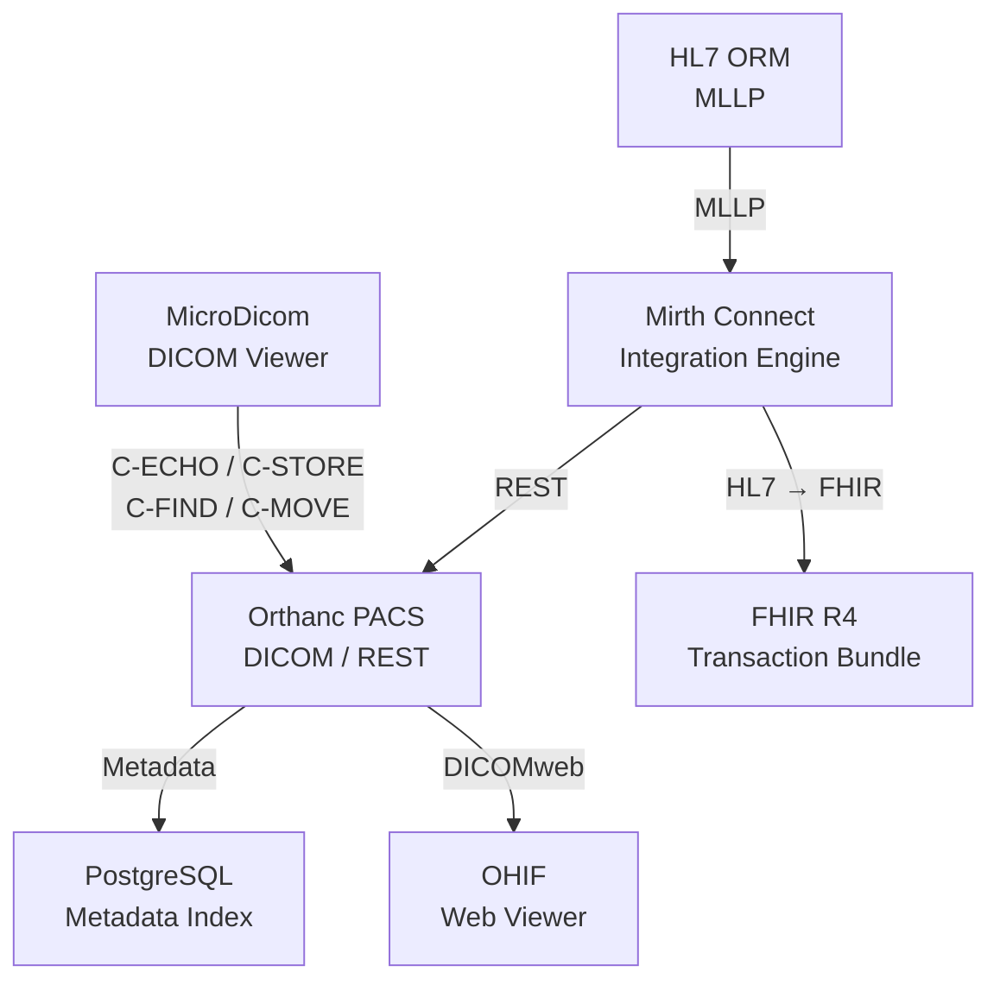

# Orthanc PACS & Healthcare IT Integration Lab

A containerized healthcare IT integration lab demonstrating **PACS administration, DICOM networking, HL7/FHIR interoperability, healthcare integration engines, REST APIs, and infrastructure troubleshooting**.

Built as a practical portfolio project for roles in:

* PACS / Clinical IT
* Healthcare IT / Medical IT
* Hospital IT Administration
* MedTech Technical Support
* System Integration
* Infrastructure & Application Support

> **Disclaimer:** Educational portfolio project. Synthetic data only. No real patient data is used. Not intended for clinical or production use.

---

## 🏗️ Architecture



---

## ⚙️ Technology Stack

| Area                 | Technologies                       |
| -------------------- | ---------------------------------- |
| PACS                 | Orthanc                            |
| DICOM Viewer         | MicroDicom                         |
| Web Viewer           | OHIF                               |
| Integration Engine   | NextGen Mirth Connect              |
| Database             | PostgreSQL 15                      |
| Healthcare Standards | DICOM, DICOMweb, HL7 v2.x, FHIR R4 |
| Protocols            | DIMSE, MLLP, REST/HTTP, TCP/IP     |
| Infrastructure       | Docker, Docker Compose, Linux/WSL2 |
| Scripting            | PowerShell, JavaScript             |
| Data Formats         | JSON, XML                          |

---

## 🚀 What I Implemented

### PACS & DICOM

* Deployed **Orthanc PACS with PostgreSQL** using Docker Compose.
* Configured DICOM AE Titles and network communication.
* Connected MicroDicom to Orthanc.
* Tested standard DICOM operations:

  * **C-ECHO** — connectivity verification
  * **C-STORE** — image transmission/storage
  * **C-FIND** — study/metadata querying
  * **C-MOVE** — query/retrieve workflow
* Integrated **OHIF** with Orthanc through **DICOMweb**.
* Tested QIDO-RS/WADO-RS workflows.
* Used the Orthanc REST API for programmatic PACS operations.

### HL7 & Mirth Connect

* Deployed **Mirth Connect** as a healthcare integration engine.
* Configured HL7 v2.x **MLLP/TCP listeners**.
* Built an **HL7 ORM → Orthanc REST** integration channel.
* Parsed and mapped:

  * Patient ID
  * Patient Name
  * Accession Number
  * Procedure Description
* Used JavaScript transformers for HL7 data extraction and
  normalization.
* Generated synthetic DICOM instances through the Orthanc REST API.

### HL7 → FHIR

* Built an **HL7 → FHIR R4 transformation pipeline**.
* Converted HL7 order/demographic information into:

  * `Patient`
  * `ServiceRequest`
* Constructed **FHIR transaction Bundles**.
* Implemented internal UUID references between FHIR resources.
* Validated the resulting JSON structure.

---

## 🔄 End-to-End Workflows

### HL7 → PACS

```text
HL7 ORM
   ↓
MLLP / TCP
   ↓
Mirth Connect
   ↓
JavaScript Transformation
   ↓
Orthanc REST API
   ↓
Synthetic DICOM
   ↓
Orthanc PACS
```

### HL7 → FHIR

```text
HL7 ORM
   ↓
Mirth Connect
   ↓
HL7 Parsing & Mapping
   ↓
Patient + ServiceRequest
   ↓
FHIR R4 Transaction Bundle
```

### DICOM Workflow

```text
MicroDicom
   ↓
DICOM DIMSE
   ↓
Orthanc PACS
   ↓
PostgreSQL Metadata Index
   ↓
DICOMweb
   ↓
OHIF Web Viewer
```

---

## 🧪 Validated Capabilities

| Capability                             | Status |
| -------------------------------------- | ------ |
| Docker Compose deployment              | ✅      |
| Orthanc PACS                           | ✅      |
| PostgreSQL integration                 | ✅      |
| DICOM C-ECHO                           | ✅      |
| DICOM C-STORE                          | ✅      |
| DICOM C-FIND                           | ✅      |
| DICOM C-MOVE                           | ✅      |
| Orthanc REST API                       | ✅      |
| DICOMweb QIDO-RS / WADO-RS             | ✅      |
| OHIF Web Viewer                        | ✅      |
| Mirth Connect                          | ✅      |
| HL7 v2.x / MLLP                        | ✅      |
| HL7 ORM → Orthanc                      | ✅      |
| HL7 → FHIR R4                          | ✅      |
| FHIR Patient / ServiceRequest          | ✅      |
| FHIR Transaction Bundle                | ✅      |
| Docker networking troubleshooting      | ✅      |
| WSL2 / host networking troubleshooting | ✅      |
| Windows firewall / TCP troubleshooting | ✅      |

---

## 💡 Skills Demonstrated

### Healthcare IT & Interoperability

* PACS administration
* DICOM networking
* DICOM DIMSE
* DICOMweb
* HL7 v2.x
* ORM / ADT concepts
* MLLP
* FHIR R4
* REST API integration
* Healthcare message transformation

### Infrastructure & Systems

* Docker
* Docker Compose
* PostgreSQL
* Linux / WSL2
* TCP/IP networking
* Port mapping
* Docker bridge networking
* Windows Firewall troubleshooting
* Service/log analysis
* Infrastructure troubleshooting

### Integration Engineering

* Mirth Connect
* JavaScript transformers
* HL7 field mapping
* JSON transformation
* FHIR resource construction
* REST-based system integration
* XML troubleshooting
* End-to-end integration testing

---

## 🎯 Project Goal

This project demonstrates practical understanding of how **PACS,
clinical systems, integration engines, databases, healthcare standards,
and network infrastructure interact in a hospital IT environment**.

It focuses not only on deploying software, but also on **integration,
protocol-level testing, troubleshooting, and end-to-end validation**.

**Technologies:** `Orthanc` `DICOM` `DICOMweb` `HL7` `FHIR` `Mirth Connect` `PostgreSQL` `Docker` `Docker Compose` `OHIF` `MicroDicom` `REST` `MLLP` `PowerShell`
